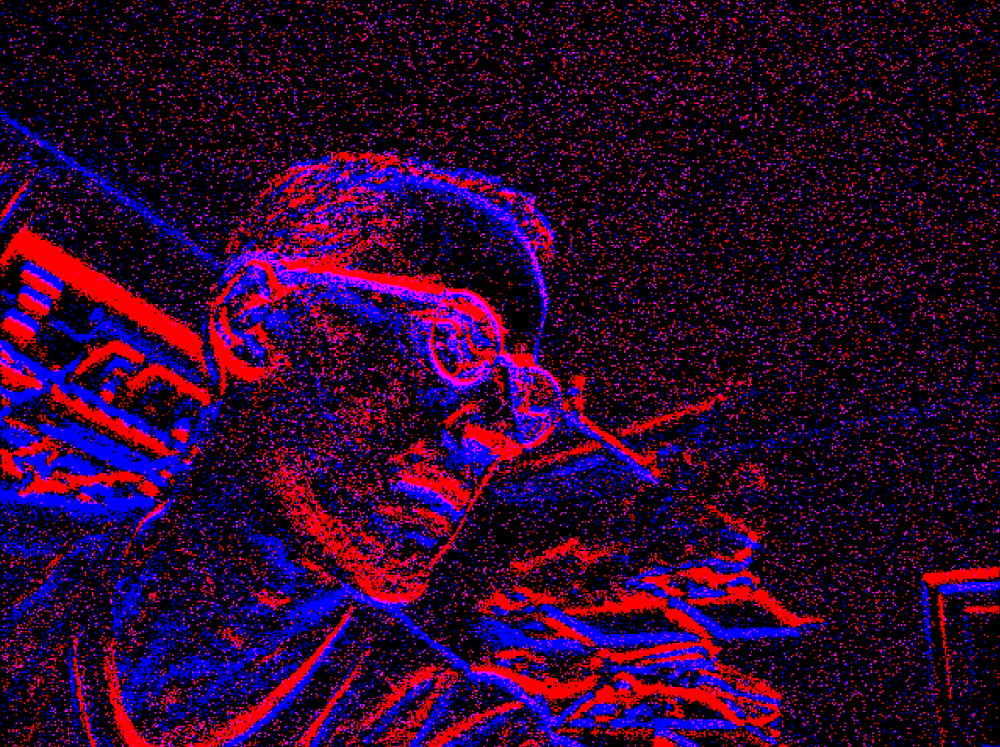

# event_camera_renderer

This repository holds tools for rendering
[event_camera_msgs](https://github.com/ros-event-camera/event_camera_msgs).



## Supported platforms

Continuous integration testing is done for ROS2 Humble and later distros.
NOTE: ROS1 is no longer supported in any form.

## How to build

Set the following shell variables:
```bash
repo=event_camera_renderer
url=https://github.com/ros-event-camera/${repo}.git
```
and follow the [instructions here](https://github.com/ros-misc-utilities/.github/blob/master/docs/build_ros_repository.md)

## How to use

Examine the launch file and adjust the topic remapping, frequency
etc, then start as follows (assuming the camera driver is running
under node name ``event_camera``):

```
# create rendered ROS image stream from events
ros2 launch event_camera_renderer renderer.launch.py camera:=event_camera
ros2 run rqt_image_view rqt_image_view
```
Note that when playing back from bag using simulated time, you must
set the clock rate much higher than ``fps``.

Parameters:

- ``fps`` Frequency (in hz) at which images are emitted. Default: 25.
- ``display_type`` Supported types are ``time_slice`` (all events
  between frames are aggregated) or ``sharp`` (number of events is
  auto-controlled to produce sharp features). Default is
  ``time_slice``. This image shows the difference (left is sharp,
  right is time_slice): 
  

## License

This software is issued under the Apache License Version 2.0.
