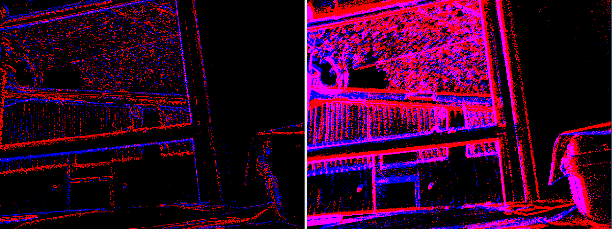

# event_array_viewer

This repository holds tools for viewing
[event_array_msgs](https://github.com/berndpfrommer/event_array_msgs). It
builds under both ROS1 and ROS2.


## Supported platforms

Currently tested on Ubuntu 20.04 under under ROS Noetic and ROS2 Galactic.


## How to build
Create a workspace (``~/ws``), clone this repo, and use ``wstool``
to pull in the remaining dependencies:

```
pkg=event_array_viewer
mkdir -p ~/$pkg/src
cd ~/ws
git clone https://github.com/berndpfrommer/${pkg}.git src/${pkg}
wstool init src src/${pkg}/${pkg}.rosinstall
# to update an existing space:
# wstool merge -t src src/${pkg}/${pkg}.rosinstall
# wstool update -t src
```

### configure and build on ROS1:

```
catkin config -DCMAKE_BUILD_TYPE=RelWithDebInfo  # (optionally add -DCMAKE_EXPORT_COMPILE_COMMANDS=1)
catkin build
```

### configure and build on ROS2:

```
cd ~/ws
colcon build --symlink-install --cmake-args -DCMAKE_BUILD_TYPE=RelWithDebInfo  # (optionally add -DCMAKE_EXPORT_COMPILE_COMMANDS=1)
```

## How to use

Examine the launch file and adjust the topic remapping, frequency
etc, then start as follows:

ROS1:
```
# create rendered ROS image stream from events
roslaunch event_array_viewer viewer.launch camera:=my_camera
rqt_image_view
```

ROS2:
```
# create rendered ROS image stream from events
ros2 launch event_array_viewer viewer.launch camera:=my_camera
ros2 run rqt_image_view rqt_image_view
```

Parameters:

- ``fps`` Frequency (in hz) at which images are emitted. Default: 25.
- ``display_type`` Supported types are ``time_slice`` (all events
  between frames are aggregated) or ``sharp`` (number of events is
  auto-controlled to produce sharp features). This image shows the
  difference:
  

## License

This software is issued under the Apache License Version 2.0.
